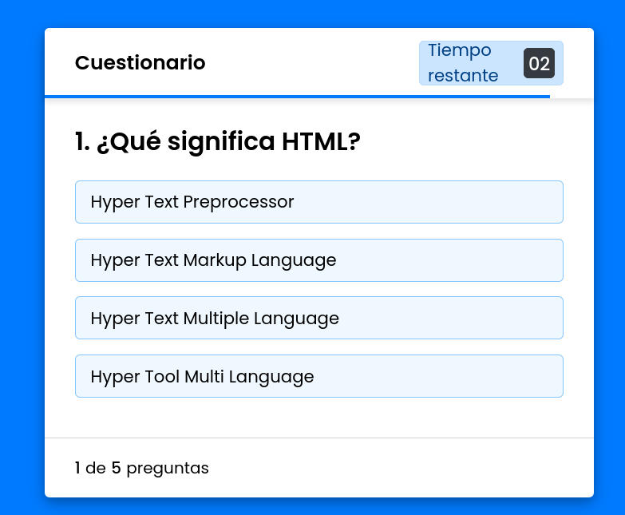

# App de Cuestionario en JS

Esta es una app hecha en JS para la materia de DES310 - Desarrollo de Componentes Web

Se presenta tanto el código inicial como el final para verificación de resultados.

La idea es que se avance y se vaya trabajando sobre la carpeta inicio y se tenga el código final a modo de ejemplo y contrastar posibles errores.

#### Versionamiento

| fecha     | Versión | Detalle de cambios  |
| ----------- | ---------- | --------------------- |
| 8/05/2023 | 1.0      | Inicio del proyecto |
|           |          |                     |
